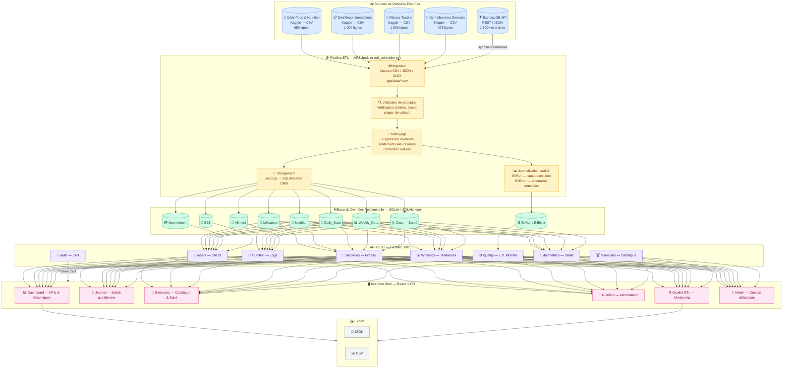
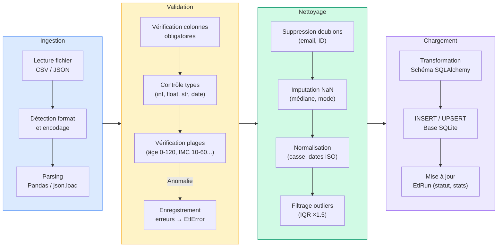
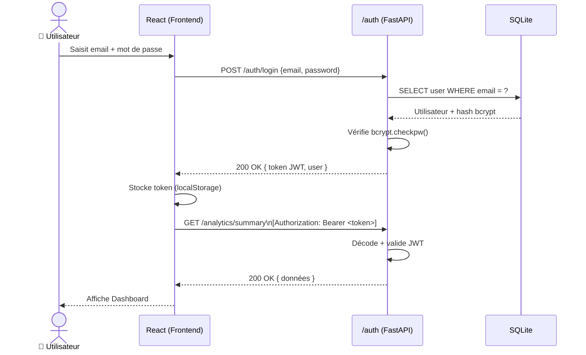

# Diagramme des Flux de Données — HealthAI Coach

## Vue d'ensemble

Ce document présente le cheminement complet des données depuis leur collecte brute jusqu'à leur exposition via l'API et leur affichage dans l'interface web.

---

## 1. Diagramme de flux global (DFD niveau 0)

---

## 2. Détail du pipeline ETL (DFD niveau 1)

---

## 3. Flux d'authentification et sécurité

---

## 4. Planification des tâches ETL automatisées

| Tâche | Déclencheur | Fréquence | Source | Destination |
|-------|-------------|-----------|--------|-------------|
| `sync_food_data` | Cron | Quotidien 00h30 | `daily_food_nutrition.csv` | Table `Nutrition` + `Aliment` |
| `sync_fitness_data` | Cron | Quotidien 01h00 | `fitness_tracker.csv` | Table `Daily_Data` + `Weekly_Data` |
| `data_quality_check` | Cron | Toutes les heures | Toutes les tables | Table `EtlRun` / `EtlError` |
| `sync_exercises` | Manuel / Hebdo | Hebdomadaire | ExerciseDB API | Table `ExerciseCache` |

---

## 5. Règles de qualité appliquées

| Dimension | Règle | Seuil d'alerte | Action corrective |
|-----------|-------|----------------|-------------------|
| **Complétude** | % de valeurs non nulles | < 95 % | Log EtlError, imputation médiane |
| **Unicité** | Doublons sur email/ID | > 0 | Suppression, conservation premier enregistrement |
| **Validité** | Valeurs dans les plages définies | > 1 % hors plage | Écrêtage (clip) aux bornes |
| **Cohérence** | BMI cohérent avec poids/taille | Écart > 5 % | Recalcul BMI |
| **Fraîcheur** | Timestamp dernière sync | > 24 h | Alerte dashboard qualité |
