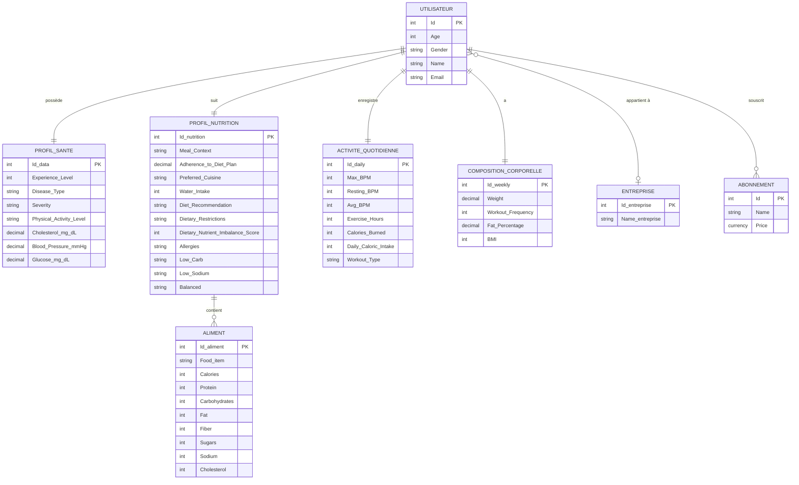
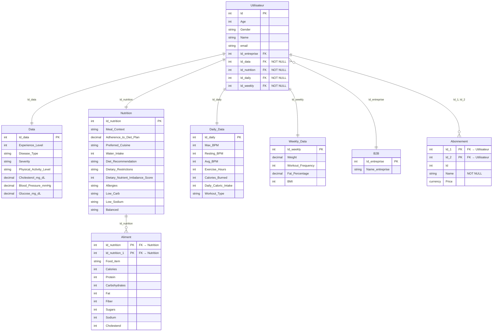

# Modèle de Données — HealthAI Coach
## Documentation Merise : MCD · MLD · MPD

---

## 1. MCD — Modèle Conceptuel de Données

Le MCD représente les entités métier, leurs attributs et les associations sémantiques entre elles, **indépendamment de toute implémentation technique**.

### Entités et associations



### Cardinalités expliquées

| Association | Cardinalité | Signification |
|-------------|------------|---------------|
| UTILISATEUR — PROFIL_SANTE | 1,1 — 1,1 | Chaque utilisateur a exactement un profil santé |
| UTILISATEUR — PROFIL_NUTRITION | 1,1 — 1,1 | Chaque utilisateur a exactement un profil nutritionnel |
| UTILISATEUR — ACTIVITE_QUOTIDIENNE | 1,1 — 1,1 | Chaque utilisateur a une fiche d'activité quotidienne |
| UTILISATEUR — COMPOSITION_CORPORELLE | 1,1 — 1,1 | Chaque utilisateur a des métriques hebdomadaires |
| UTILISATEUR — ENTREPRISE | 0,1 — 0,N | Un utilisateur peut appartenir à 0 ou 1 entreprise (B2B) |
| UTILISATEUR — ABONNEMENT | 1,1 — 0,N | Un utilisateur souscrit à un abonnement |
| PROFIL_NUTRITION — ALIMENT | 1,N — 0,N | Un profil peut référencer plusieurs aliments |

---

## 2. MLD — Modèle Logique de Données

Le MLD traduit le MCD en tables relationnelles avec clés primaires (PK) et clés étrangères (FK), **indépendamment du SGBD**.



### Règles d'intégrité référentielle

| Table | Contrainte | Description |
|-------|-----------|-------------|
| `Utilisateur.Id_data` | NOT NULL + FK | Tout utilisateur doit avoir un profil santé |
| `Utilisateur.Id_nutrition` | NOT NULL + FK | Tout utilisateur doit avoir un profil nutrition |
| `Utilisateur.Id_daily` | NOT NULL + FK | Tout utilisateur doit avoir des données quotidiennes |
| `Utilisateur.Id_weekly` | NOT NULL + FK | Tout utilisateur doit avoir des données hebdomadaires |
| `Utilisateur.Id_entreprise` | NULLABLE + FK | Un utilisateur peut ne pas être lié à une entreprise |
| `Abonnement.(Id_1, Id_2)` | PK composite | Liaison utilisateur-abonnement |

---

## 3. MPD — Modèle Physique de Données

Le MPD correspond à l'implémentation SQL réelle sur le SGBD cible (SQLite pour le prototype, PostgreSQL pour la production).

### Schéma complet avec types natifs

```sql
-- ============================================================
-- MPD — HealthAI Coach
-- SGBD cible : SQLite (prototype) / PostgreSQL (production)
-- ============================================================

-- TABLE CENTRALE : Données médicales
CREATE TABLE Data (
    Id_data               INTEGER       PRIMARY KEY AUTOINCREMENT,
    Experience_Level      INTEGER       CHECK (Experience_Level BETWEEN 0 AND 10),
    Disease_Type          VARCHAR(50),
    Severity              VARCHAR(20)   CHECK (Severity IN ('légère','modérée','grave')),
    Physical_Activity_Level VARCHAR(50),
    Cholesterol_mg_dL     DECIMAL(5,2)  CHECK (Cholesterol_mg_dL > 0),
    Blood_Pressure_mmHg   DECIMAL(5,2)  CHECK (Blood_Pressure_mmHg > 0),
    Glucose_mg_dL         DECIMAL(5,2)  CHECK (Glucose_mg_dL > 0)
);

-- TABLE : Profil nutritionnel
CREATE TABLE Nutrition (
    Id_nutrition                     INTEGER     PRIMARY KEY AUTOINCREMENT,
    Meal_Context                     VARCHAR(50),
    Adherence_to_Diet_Plan           DECIMAL(5,2) CHECK (Adherence_to_Diet_Plan BETWEEN 0 AND 100),
    Preferred_Cuisine                VARCHAR(50),
    Water_Intake                     INTEGER      CHECK (Water_Intake >= 0),
    Diet_Recommendation              VARCHAR(50),
    Dietary_Restrictions             VARCHAR(50),
    Dietary_Nutrient_Imbalance_Score INTEGER      CHECK (Dietary_Nutrient_Imbalance_Score BETWEEN 0 AND 100),
    Allergies                        VARCHAR(100),
    Low_Carb                         VARCHAR(10),
    Low_Sodium                       VARCHAR(10),
    Balanced                         VARCHAR(10)
);

-- TABLE : Métriques journalières
CREATE TABLE Daily_Data (
    Id_daily             INTEGER     PRIMARY KEY AUTOINCREMENT,
    Max_BPM              INTEGER     CHECK (Max_BPM BETWEEN 30 AND 250),
    Resting_BPM          INTEGER     CHECK (Resting_BPM BETWEEN 30 AND 120),
    Avg_BPM              INTEGER     CHECK (Avg_BPM BETWEEN 30 AND 250),
    Exercise_Hours       INTEGER     CHECK (Exercise_Hours BETWEEN 0 AND 24),
    Calories_Burned      INTEGER     CHECK (Calories_Burned >= 0),
    Daily_Caloric_Intake INTEGER     CHECK (Daily_Caloric_Intake >= 0),
    Workout_Type         VARCHAR(50)
);

-- TABLE : Composition corporelle hebdomadaire
CREATE TABLE Weekly_Data (
    Id_weekly         INTEGER     PRIMARY KEY AUTOINCREMENT,
    Weight            DECIMAL(5,2) CHECK (Weight BETWEEN 1 AND 500),
    Workout_Frequency INTEGER      CHECK (Workout_Frequency BETWEEN 0 AND 7),
    Fat_Percentage    DECIMAL(5,2) CHECK (Fat_Percentage BETWEEN 0 AND 100),
    BMI               INTEGER      CHECK (BMI BETWEEN 10 AND 60)
);

-- TABLE : Entreprises partenaires (B2B)
CREATE TABLE B2B (
    Id_entreprise  INTEGER     PRIMARY KEY AUTOINCREMENT,
    Name_entreprise VARCHAR(100) NOT NULL UNIQUE
);

-- TABLE PRINCIPALE : Utilisateurs
CREATE TABLE Utilisateur (
    Id             INTEGER     PRIMARY KEY AUTOINCREMENT,
    Age            INTEGER     CHECK (Age BETWEEN 0 AND 120),
    Gender         VARCHAR(20),
    Name           VARCHAR(100),
    email          VARCHAR(100) UNIQUE NOT NULL,
    Id_entreprise  INTEGER     REFERENCES B2B(Id_entreprise) ON DELETE SET NULL,
    Id_data        INTEGER     NOT NULL REFERENCES Data(Id_data) ON DELETE CASCADE,
    Id_nutrition   INTEGER     NOT NULL REFERENCES Nutrition(Id_nutrition) ON DELETE CASCADE,
    Id_daily       INTEGER     NOT NULL REFERENCES Daily_Data(Id_daily) ON DELETE CASCADE,
    Id_weekly      INTEGER     NOT NULL REFERENCES Weekly_Data(Id_weekly) ON DELETE CASCADE
);

-- TABLE : Abonnements
CREATE TABLE Abonnement (
    Id_1   INTEGER     NOT NULL REFERENCES Utilisateur(Id) ON DELETE CASCADE,
    Id_2   INTEGER     NOT NULL REFERENCES Utilisateur(Id) ON DELETE CASCADE,
    Id     INTEGER     NOT NULL,
    Name   VARCHAR(50) NOT NULL CHECK (Name IN ('Freemium','Premium','Premium+','B2B')),
    Price  DECIMAL(6,2) CHECK (Price >= 0),
    PRIMARY KEY (Id_1, Id_2)
);

-- TABLE : Catalogue alimentaire
CREATE TABLE Aliment (
    Id_nutrition    INTEGER     NOT NULL REFERENCES Nutrition(Id_nutrition),
    Id_nutrition_1  INTEGER     NOT NULL REFERENCES Nutrition(Id_nutrition),
    Food_item       VARCHAR(100),
    Calories        INTEGER     CHECK (Calories >= 0),
    Protein         INTEGER     CHECK (Protein >= 0),
    Carbohydrates   INTEGER     CHECK (Carbohydrates >= 0),
    Fat             INTEGER     CHECK (Fat >= 0),
    Fiber           INTEGER     CHECK (Fiber >= 0),
    Sugars          INTEGER     CHECK (Sugars >= 0),
    Sodium          INTEGER     CHECK (Sodium >= 0),
    Cholesterol     INTEGER     CHECK (Cholesterol >= 0),
    PRIMARY KEY (Id_nutrition, Id_nutrition_1)
);

-- ============================================================
-- INDEX DE PERFORMANCE
-- ============================================================
CREATE INDEX idx_utilisateur_email    ON Utilisateur(email);
CREATE INDEX idx_utilisateur_entreprise ON Utilisateur(Id_entreprise);
CREATE INDEX idx_aliment_food_item    ON Aliment(Food_item);
CREATE INDEX idx_abonnement_name      ON Abonnement(Name);
```

---

## 4. Correspondance MCD → MLD → MPD

| MCD (Entité) | MLD (Table) | MPD (Type SQLite) |
|---|---|---|
| UTILISATEUR | Utilisateur | INTEGER PK + VARCHAR |
| PROFIL_SANTE | Data | DECIMAL(5,2) + CHECK |
| PROFIL_NUTRITION | Nutrition | DECIMAL(5,2) + CHECK 0-100 |
| ACTIVITE_QUOTIDIENNE | Daily_Data | INTEGER + CHECK BPM |
| COMPOSITION_CORPORELLE | Weekly_Data | DECIMAL(5,2) + CHECK |
| ENTREPRISE | B2B | VARCHAR UNIQUE NOT NULL |
| ABONNEMENT | Abonnement | PK composite (Id_1, Id_2) |
| ALIMENT | Aliment | PK composite + FK Nutrition |

---

## 5. Évolution vers PostgreSQL (production)

| Différence | SQLite (prototype) | PostgreSQL (production) |
|---|---|---|
| Auto-incrément | `AUTOINCREMENT` | `SERIAL` ou `GENERATED ALWAYS AS IDENTITY` |
| Type monétaire | `DECIMAL(6,2)` | `MONEY` ou `NUMERIC(10,2)` |
| Migrations | Scripts manuels | Alembic (`alembic upgrade head`) |
| Concurrence | Mono-utilisateur | Multi-utilisateurs (MVCC) |
| Performances | < 10 000 lignes | Millions de lignes + Index avancés |
